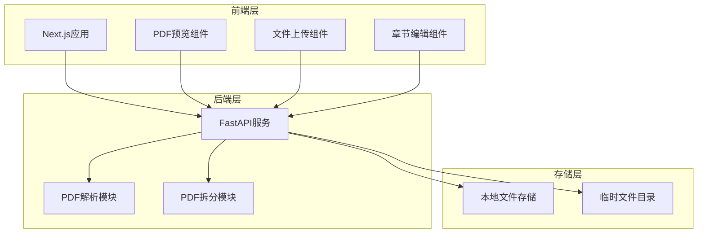

# 设计文档

## 概述

PDF章节拆分系统是一个简化的Web应用程序，专门用于处理50MB以内的PDF文档章节拆分。系统采用现代化的前后端分离架构，使用Next.js作为前端框架，FastAPI作为后端服务，专注于学习和实践目的，提供简洁高效的PDF章节拆分解决方案。

## 架构设计

### 整体架构



### 技术栈选择

**前端技术栈：**
- **Next.js 14**：现代React框架，支持SSR和静态生成
- **TypeScript**：类型安全的JavaScript超集
- **Tailwind CSS**：实用优先的CSS框架
- **React Hook Form**：高性能表单库
- **Axios**：HTTP客户端库

**后端技术栈：**
- **FastAPI**：现代Python Web框架，自动API文档生成
- **PyPDF2/PyMuPDF**：Python PDF处理库
- **Pydantic**：数据验证和设置管理
- **Uvicorn**：ASGI服务器
- **Python-multipart**：文件上传支持

## 组件和接口

### 前端组件架构

```typescript
// Next.js页面结构
interface PageStructure {
  pages: {
    index: HomePage;           // 主页面，包含上传和处理流程
    api: {
      upload: UploadAPI;       // 文件上传API路由
      analyze: AnalyzeAPI;     // 章节分析API路由
      split: SplitAPI;         // PDF拆分API路由
      download: DownloadAPI;   // 文件下载API路由
    };
  };
  
  components: {
    FileUpload: FileUploadComponent;
    PDFPreview: PDFPreviewComponent;
    ChapterEditor: ChapterEditorComponent;
    ProgressBar: ProgressBarComponent;
    DownloadLinks: DownloadLinksComponent;
  };
}
```

### API接口设计

**文件上传接口：**
```python
# POST /api/upload - 上传PDF文件
class UploadResponse(BaseModel):
    file_id: str
    filename: str
    file_size: int
    message: str

@app.post("/api/upload")
async def upload_file(file: UploadFile) -> UploadResponse:
    """上传PDF文件"""
    pass
```

**章节分析接口：**
```python
# POST /api/analyze - 分析PDF章节结构
class ChapterInfo(BaseModel):
    title: str
    start_page: int
    end_page: int

class AnalyzeRequest(BaseModel):
    file_id: str

class AnalyzeResponse(BaseModel):
    chapters: List[ChapterInfo]
    total_pages: int

@app.post("/api/analyze")
async def analyze_chapters(request: AnalyzeRequest) -> AnalyzeResponse:
    """分析PDF章节结构"""
    pass
```

**PDF拆分接口：**
```python
# POST /api/split - 拆分PDF文件
class SplitRequest(BaseModel):
    file_id: str
    chapters: List[ChapterInfo]

class SplitResponse(BaseModel):
    task_id: str
    status: str
    download_links: List[str]

@app.post("/api/split")
async def split_pdf(request: SplitRequest) -> SplitResponse:
    """拆分PDF文件"""
    pass
```

**文件下载接口：**
```python
# GET /api/download/{file_id} - 下载文件
@app.get("/api/download/{file_id}")
async def download_file(file_id: str):
    """下载拆分后的文件"""
    pass
```

## 数据模型

### 文件系统结构

```
uploads/
├── {file_id}/
│   ├── original.pdf          # 原始上传文件
│   ├── chapters/             # 拆分后的章节文件
│   │   ├── chapter_1.pdf
│   │   ├── chapter_2.pdf
│   │   └── ...
│   └── metadata.json         # 文件元数据
└── temp/                     # 临时文件目录
```

### Python数据模型

```python
# Pydantic数据模型
from pydantic import BaseModel
from typing import List, Optional
from datetime import datetime

class FileInfo(BaseModel):
    file_id: str
    filename: str
    file_size: int
    file_path: str
    upload_time: datetime
    status: str  # 'uploaded', 'analyzed', 'split', 'error'

class ChapterInfo(BaseModel):
    title: str
    start_page: int
    end_page: int
    page_count: int

class PDFMetadata(BaseModel):
    file_id: str
    filename: str
    total_pages: int
    file_size: int
    chapters: List[ChapterInfo]
    created_at: datetime
    status: str

class SplitTask(BaseModel):
    task_id: str
    file_id: str
    chapters: List[ChapterInfo]
    status: str  # 'pending', 'processing', 'completed', 'failed'
    progress: int  # 0-100
    error_message: Optional[str] = None
    created_at: datetime
    completed_at: Optional[datetime] = None
```

### 前端TypeScript类型

```typescript
// TypeScript接口定义
interface FileInfo {
  fileId: string;
  filename: string;
  fileSize: number;
  uploadTime: string;
  status: 'uploaded' | 'analyzed' | 'split' | 'error';
}

interface ChapterInfo {
  title: string;
  startPage: number;
  endPage: number;
  pageCount: number;
}

interface PDFMetadata {
  fileId: string;
  filename: string;
  totalPages: number;
  fileSize: number;
  chapters: ChapterInfo[];
  createdAt: string;
  status: string;
}

interface SplitTask {
  taskId: string;
  fileId: string;
  chapters: ChapterInfo[];
  status: 'pending' | 'processing' | 'completed' | 'failed';
  progress: number;
  errorMessage?: string;
  createdAt: string;
  completedAt?: string;
}
```

## 正确性属性

*属性是指在系统的所有有效执行中都应该成立的特征或行为——本质上是关于系统应该做什么的正式声明。属性作为人类可读规范和机器可验证正确性保证之间的桥梁。*

基于需求分析，以下是系统必须满足的核心正确性属性：

### 文件上传属性

**属性 1：文件验证一致性**
*对于任何*上传的文件，系统的验证结果应该基于文件的实际格式和大小，而不是文件名或其他元数据
**验证需求：1.2**

**属性 2：文件大小限制准确性**
*对于任何*超过50MB的文件，系统应该拒绝上传并返回适当的错误消息
**验证需求：1.3**

**属性 3：上传进度单调性**
*对于任何*文件上传过程，进度百分比应该单调递增直到完成
**验证需求：1.4**

### PDF预览属性

**属性 4：PDF渲染完整性**
*对于任何*有效的PDF文件，系统应该能够正确渲染并显示PDF内容
**验证需求：2.1**

**属性 5：页码信息准确性**
*对于任何*PDF文件，显示的当前页码和总页数应该与实际PDF页面信息一致
**验证需求：2.2**

**属性 6：页面导航正确性**
*对于任何*PDF文件，页面导航操作应该正确切换到指定页面
**验证需求：2.3**

### 章节识别属性

**属性 7：章节边界非重叠性**
*对于任何*识别出的章节集合，任意两个章节的页面范围不应该重叠
**验证需求：3.2, 4.4**

**属性 8：章节覆盖完整性**
*对于任何*PDF文件，所有识别出的章节应该覆盖文件的全部页面，不应有遗漏
**验证需求：3.2**

**属性 9：备选方案生成**
*对于任何*无法识别章节结构的PDF文件，系统应该提供基于页数的平均分割建议
**验证需求：3.4**

### 手动编辑属性

**属性 10：章节标题更新一致性**
*对于任何*章节标题修改操作，系统应该立即更新并保持数据一致性
**验证需求：4.2**

**属性 11：页码范围验证**
*对于任何*页码范围调整，系统应该验证范围的有效性并防止无效输入
**验证需求：4.3**

**属性 12：章节范围自动调整**
*对于任何*章节添加或删除操作，系统应该自动调整相邻章节范围以维护非重叠性
**验证需求：4.4, 4.5**

### 拆分处理属性

**属性 13：拆分内容完整性**
*对于任何*拆分操作，所有章节文件的页面总数应该等于原始PDF的页面数
**验证需求：5.2**

**属性 14：拆分进度准确性**
*对于任何*拆分任务，报告的进度应该反映实际处理状态
**验证需求：5.3**

### 下载属性

**属性 15：下载链接有效性**
*对于任何*成功拆分的文件，生成的下载链接应该能够正确下载对应的章节文件
**验证需求：6.1, 6.2**

**属性 16：文件命名规范性**
*对于任何*章节文件，文件名应该遵循清晰的命名规则并包含章节信息
**验证需求：6.4**

### 响应式设计属性

**属性 17：界面适应性**
*对于任何*屏幕尺寸变化，界面元素应该保持可用性和可读性
**验证需求：7.3**

### API属性

**属性 18：API响应格式一致性**
*对于任何*API请求，响应应该遵循一致的数据格式和状态码规范
**验证需求：8.1, 8.2, 8.3, 8.4**

**属性 19：API错误处理规范性**
*对于任何*API错误，响应应该包含适当的HTTP状态码和清晰的错误信息
**验证需求：8.5**

## 错误处理

### 错误分类和处理策略

**前端错误处理：**
```typescript
// 错误类型定义
enum ErrorType {
  FILE_TOO_LARGE = 'FILE_TOO_LARGE',
  INVALID_FORMAT = 'INVALID_FORMAT',
  NETWORK_ERROR = 'NETWORK_ERROR',
  PROCESSING_ERROR = 'PROCESSING_ERROR',
  VALIDATION_ERROR = 'VALIDATION_ERROR'
}

interface ErrorResponse {
  error: string;
  message: string;
  details?: any;
}

// 错误处理函数
const handleError = (error: ErrorType, context?: any) => {
  switch (error) {
    case ErrorType.FILE_TOO_LARGE:
      showToast('文件大小超过50MB限制', 'error');
      break;
    case ErrorType.INVALID_FORMAT:
      showToast('请上传有效的PDF文件', 'error');
      break;
    case ErrorType.NETWORK_ERROR:
      showToast('网络连接错误，请重试', 'error');
      break;
    default:
      showToast('发生未知错误', 'error');
  }
};
```

**后端错误处理：**
```python
# FastAPI错误处理
from fastapi import HTTPException
from fastapi.responses import JSONResponse

class APIError(Exception):
    def __init__(self, status_code: int, message: str, details: dict = None):
        self.status_code = status_code
        self.message = message
        self.details = details or {}

@app.exception_handler(APIError)
async def api_error_handler(request, exc: APIError):
    return JSONResponse(
        status_code=exc.status_code,
        content={
            "error": "API_ERROR",
            "message": exc.message,
            "details": exc.details
        }
    )

# 文件大小验证
def validate_file_size(file_size: int):
    if file_size > 50 * 1024 * 1024:  # 50MB
        raise APIError(413, "文件大小超过50MB限制")

# PDF格式验证
def validate_pdf_format(file_content: bytes):
    if not file_content.startswith(b'%PDF'):
        raise APIError(400, "文件格式无效，请上传PDF文件")
```

### 重试和恢复机制

**简化的错误恢复：**
- 文件上传失败：提示用户重新上传
- 章节识别失败：提供手动编辑选项
- 拆分处理失败：显示错误信息并允许重试
- 网络错误：自动重试最多3次

## 测试策略

### 双重测试方法

系统采用单元测试和基于属性的测试相结合的综合测试策略：

**单元测试覆盖：**
- 具体示例验证：测试特定输入的预期输出
- 边界条件测试：文件大小限制（50MB）、页面范围边界
- 组件集成测试：前后端接口和数据传递
- 错误条件测试：异常输入和错误场景

**基于属性的测试覆盖：**
- 使用**Hypothesis (Python)**进行FastAPI服务的属性测试
- 使用**fast-check (TypeScript)**进行Next.js前端组件的属性测试

**测试配置要求：**
- 每个基于属性的测试运行最少100次迭代
- 每个属性测试必须包含明确的注释，引用设计文档中的对应属性
- 注释格式：`**功能：pdf-chapter-splitter，属性 {编号}：{属性文本}**`
- 每个正确性属性必须由单一的基于属性的测试实现

**测试数据生成：**
- PDF文件生成器：创建各种结构和大小的测试PDF（≤50MB）
- 章节数据生成器：生成有效和无效的章节定义
- 边界条件测试：测试50MB文件大小限制

### 性能测试

**简化的性能测试：**
- 文件上传测试：测试50MB文件的上传性能
- 拆分处理测试：测试不同页数PDF的拆分速度
- 内存使用监控：确保50MB文件处理时内存使用合理

**性能指标：**
- 上传速度：在良好网络条件下能够正常上传50MB文件
- 拆分速度：能够在合理时间内完成PDF拆分
- 内存使用：处理50MB文件时内存使用不超过系统限制
- 响应时间：API响应时间在可接受范围内

## 部署和运维

### 简化部署方案

**开发环境：**
```bash
# 前端开发服务器
cd frontend
npm run dev  # 运行在 http://localhost:3000

# 后端开发服务器
cd backend
uvicorn main:app --reload --port 8000  # 运行在 http://localhost:8000
```

**生产环境Docker部署：**
```yaml
# docker-compose.yml
version: '3.8'
services:
  frontend:
    build: 
      context: ./frontend
      dockerfile: Dockerfile
    ports:
      - "3000:3000"
    environment:
      - NEXT_PUBLIC_API_URL=http://localhost:8000
    depends_on:
      - backend

  backend:
    build:
      context: ./backend
      dockerfile: Dockerfile
    ports:
      - "8000:8000"
    environment:
      - UPLOAD_DIR=/app/uploads
      - MAX_FILE_SIZE=52428800  # 50MB in bytes
    volumes:
      - ./uploads:/app/uploads
      - ./temp:/app/temp

volumes:
  uploads:
  temp:
```

### 文件管理

**文件存储策略：**
- 上传文件存储在本地 `uploads/` 目录
- 临时文件存储在 `temp/` 目录
- 定期清理超过24小时的临时文件
- 文件按日期组织目录结构

**存储限制：**
- 单文件最大50MB
- 总存储空间根据服务器配置
- 自动清理过期文件

### 日志和监控

**简化的日志记录：**
```python
# Python日志配置
import logging

logging.basicConfig(
    level=logging.INFO,
    format='%(asctime)s - %(name)s - %(levelname)s - %(message)s',
    handlers=[
        logging.FileHandler('app.log'),
        logging.StreamHandler()
    ]
)

logger = logging.getLogger(__name__)
```

**基本监控：**
- 应用日志记录关键操作
- 错误日志记录异常情况
- 文件操作审计日志
- 简单的健康检查端点

### 安全考虑

**基本安全措施：**
- 文件类型验证：仅允许PDF文件
- 文件大小限制：严格限制50MB
- 路径遍历防护：验证文件路径安全性
- 输入验证：验证所有用户输入
- CORS配置：适当的跨域资源共享设置

**文件安全：**
- 上传文件存储在安全目录
- 临时文件及时清理
- 文件访问权限控制
- 恶意文件基本检测